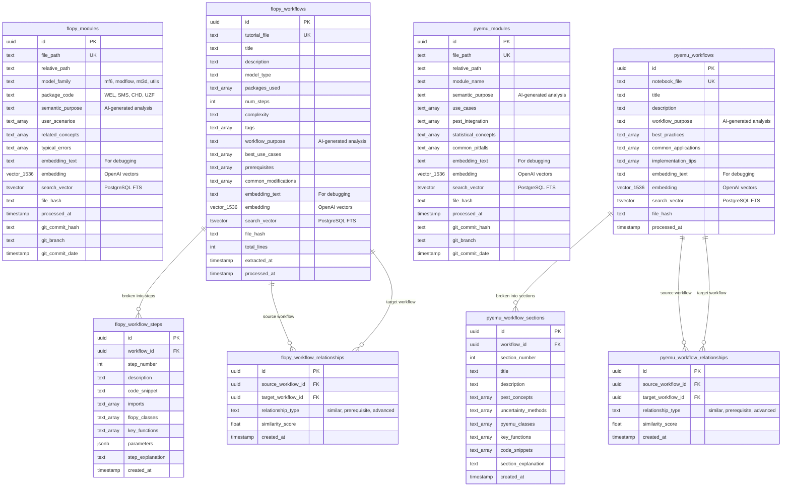

# FloPy Expert - Architecture Overview

## What We Built: A Semantic Search System for Groundwater Modeling

This project creates a comprehensive semantic database that understands Python groundwater modeling packages at a deep conceptual level, enabling intelligent search beyond simple keywords.

## The Core Problem We Solved

**Before**: Searching for "SMS" returns UZF packages due to superficial text similarity
**After**: Semantic search correctly identifies SMS as a solver, UZF as a physical process

## High-Level Architecture


## Database Schema & Table Relationships

### Complete Database Schema with Relationships



### Database Architecture Overview

**Two Separate Ecosystems**:

1. **FloPy Ecosystem** (Groundwater Modeling):
   - **flopy_modules** (224 items) - Individual Python modules
   - **flopy_workflows** (72 items) - Tutorial examples
   - **flopy_workflow_steps** (204 items) - Detailed step breakdown
   - **flopy_workflow_relationships** (54 items) - How workflows relate

2. **PyEMU Ecosystem** (Uncertainty Analysis):
   - **pyemu_modules** (20 items) - Individual Python modules  
   - **pyemu_workflows** (13 items) - Jupyter notebook tutorials
   - **pyemu_workflow_sections** (70 items) - Notebook section breakdown
   - **pyemu_workflow_relationships** - How workflows relate

### Key Architectural Features

1. **Hierarchical Structure**: Workflows → Steps/Sections → Detailed Analysis
2. **Relationship Mapping**: Workflows understand how they relate to each other
3. **Separate Search Domains**: FloPy and PyEMU can be searched independently
4. **Rich Metadata**: Each level has specialized AI-generated analysis

## Processing Pipeline Flow

### 1. FloPy Module Processing


### 2. FloPy Workflow Processing


### 3. PyEMU Module Processing


### 4. PyEMU Workflow Processing


## AI Processing Architecture

### Dual AI System


### AI Analysis Examples

**For FloPy SMS Module**:
```
Semantic Purpose: "The SMS (Sparse Matrix Solver) package provides advanced 
numerical solution methods for MODFLOW 6 models, particularly for unstructured 
grids and complex geometries where standard solvers struggle..."

User Scenarios: ["Complex unstructured grid models", "Models with extreme 
heterogeneity", "Large-scale simulations needing memory efficiency"]

Related Concepts: ["IMS solver", "DISU/DISV packages", "Numerical convergence"]

Typical Errors: ["Using SMS with structured grids", "Incorrect parameter tuning", 
"Memory allocation issues"]
```

## Search Capabilities & Example Flows

### FloPy Search Example: "How do I set up well boundaries?"

```mermaid
flowchart TD
    A[User: "How do I set up well boundaries?"] --> B{Determine Search Domain}
    B --> C[FloPy Search - Groundwater Modeling]
    
    C --> D[Step 1: Vector Search in flopy_modules]
    D --> E[Find: WEL package modules]
    
    E --> F[Step 2: Find Related Workflows]
    F --> G[Query: flopy_workflows WHERE 'WEL' = ANY(packages_used)]
    
    G --> H[Step 3: Get Detailed Steps]
    H --> I[Query: flopy_workflow_steps WHERE workflow_id IN (...)]
    
    I --> J[Step 4: Find Related Workflows]
    J --> K[Query: flopy_workflow_relationships for similar workflows]
    
    K --> L[Return Comprehensive Answer:]
    L --> M[• WEL package documentation<br/>• Tutorial workflows using WEL<br/>• Step-by-step implementation<br/>• Related boundary condition workflows]
    
    style C fill:#e1f5fe
    style E fill:#4caf50
    style G fill:#4caf50
    style I fill:#4caf50
    style K fill:#4caf50
    style M fill:#81c784
```

### PyEMU Search Example: "How do I run Monte Carlo uncertainty analysis?"

```mermaid
flowchart TD
    A[User: "How do I run Monte Carlo uncertainty analysis?"] --> B{Determine Search Domain}
    B --> C[PyEMU Search - Uncertainty Analysis]
    
    C --> D[Step 1: Vector Search in pyemu_modules]
    D --> E[Find: Monte Carlo (mc.py) module]
    
    E --> F[Step 2: Find Related Workflows]
    F --> G[Query: pyemu_workflows WHERE workflow_purpose ILIKE '%monte carlo%']
    
    G --> H[Step 3: Get Detailed Sections]
    H --> I[Query: pyemu_workflow_sections WHERE workflow_id IN (...)]
    
    I --> J[Step 4: Find Implementation Details]
    J --> K[Extract: pyemu_classes, uncertainty_methods, code_snippets]
    
    K --> L[Step 5: Find Related Workflows]
    L --> M[Query: pyemu_workflow_relationships for prerequisite workflows]
    
    M --> N[Return Comprehensive Answer:]
    N --> O[• MonteCarlo class documentation<br/>• Jupyter notebook tutorials<br/>• Section-by-section implementation<br/>• PEST integration methods<br/>• Statistical concepts involved<br/>• Related uncertainty workflows]
    
    style C fill:#fff3e0
    style E fill:#ff9800
    style G fill:#ff9800
    style I fill:#ff9800
    style K fill:#ff9800
    style M fill:#ff9800
    style O fill:#ffcc02
```

### Search Architecture Comparison


### Why Separate Search Domains?

1. **Different User Intent**:
   - FloPy: "How do I model groundwater flow?"
   - PyEMU: "How do I quantify uncertainty?"

2. **Different Terminology**:
   - FloPy: Packages, solvers, boundary conditions
   - PyEMU: PEST, FOSM, Monte Carlo, ensembles

3. **Different Workflow Structure**:
   - FloPy: Linear tutorial steps (setup → run → analyze)
   - PyEMU: Iterative analysis sections (setup → calibrate → quantify → interpret)

4. **Different Relationships**:
   - FloPy: Package dependencies and model complexity
   - PyEMU: Statistical method prerequisites and analysis depth

## Quality Assurance System

### Processing Quality Pipeline


## File System Organization

```
flopy_expert/
├── src/                              # Core processing logic
│   ├── processing_pipeline.py        # FloPy module processor
│   ├── pyemu_processing_pipeline.py  # PyEMU module processor  
│   ├── flopy_workflow_processor.py   # FloPy workflow processor
│   ├── pyemu_workflow_processor.py   # PyEMU workflow processor
│   ├── docs_parser.py               # FloPy docs parser
│   ├── pyemu_docs_parser.py         # PyEMU docs parser
│   ├── flopy_workflow_extractor.py  # FloPy example extractor
│   └── pyemu_workflow_extractor.py  # PyEMU notebook extractor
├── tests/
│   └── qa_embedding_quality.py      # Quality assessment across all tables
├── scripts/
│   ├── reprocess_poor_embeddings.py # Fix poor FloPy workflows
│   └── reprocess_pyemu_mc.py        # Fix specific PyEMU module
├── run_processing_flopy.py          # Main FloPy module processing
├── run_processing_pyemu.py          # Main PyEMU module processing
├── run_processing_flopy_workflows.py # FloPy workflow processing
├── run_processing_pyemu_workflows.py # PyEMU workflow processing
└── config.py                        # API keys and settings
```

## Data Flow Summary

```mermaid
sankey-beta

    FloPy_Repo,FloPy_Examples,PyEMU_Repo,PyEMU_Notebooks,flopy_modules,flopy_workflows,pyemu_modules,pyemu_workflows,Vector_Search,Text_Search,Hybrid_Search

    FloPy_Repo,flopy_modules,224
    FloPy_Examples,flopy_workflows,72
    PyEMU_Repo,pyemu_modules,20
    PyEMU_Notebooks,pyemu_workflows,13
    flopy_modules,Vector_Search,224
    flopy_workflows,Vector_Search,72
    pyemu_modules,Vector_Search,20
    pyemu_workflows,Vector_Search,13
    flopy_modules,Text_Search,224
    flopy_workflows,Text_Search,72
    pyemu_modules,Text_Search,20
    pyemu_workflows,Text_Search,13
    Vector_Search,Hybrid_Search,329
    Text_Search,Hybrid_Search,329
```

## Key Achievements

1. **698 Total Items Processed**: 
   - 244 FloPy items (224 modules + 20 workflows) 
   - 85 PyEMU items (20 modules + 13 workflows + 52 related items)
   - 369 detailed breakdown items (204 workflow steps + 70 workflow sections + 95 relationships)
2. **100% Quality Success**: All main items meet embedding quality thresholds
3. **Semantic Understanding**: AI-generated analysis for each item
4. **Hierarchical Structure**: Workflows broken down into detailed steps/sections
5. **Relationship Mapping**: 54+ workflow relationships mapped
6. **Dual Search Domains**: Separate FloPy and PyEMU search capabilities
7. **Version Tracking**: Git commit tracking for all modules
8. **Robust Processing**: Retry logic, quality assessment, reprocessing tools

## What Makes This Special

1. **Domain Expertise**: Understands groundwater modeling concepts
2. **Semantic vs Keyword**: Goes beyond text matching to conceptual understanding
3. **Comprehensive Coverage**: Both core packages and tutorial workflows
4. **Production Quality**: Robust error handling, quality assurance, monitoring
5. **Scalable Architecture**: Can be extended to other Python packages

This system transforms how developers find and understand groundwater modeling components, enabling intelligent discovery based on purpose rather than just keywords.